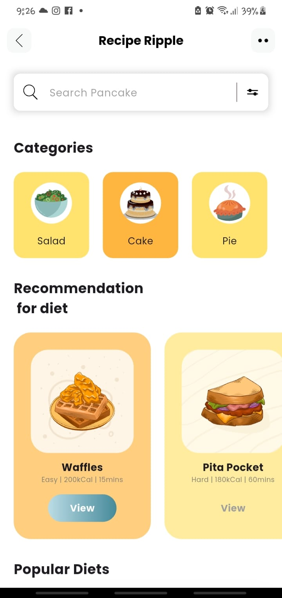
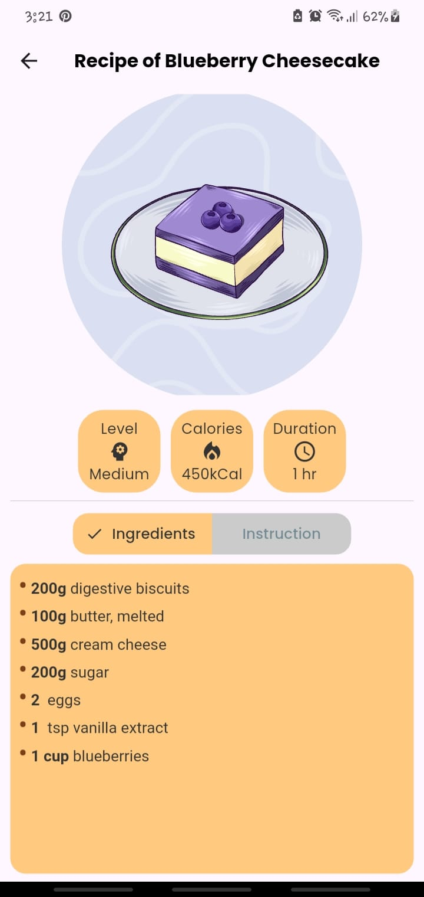
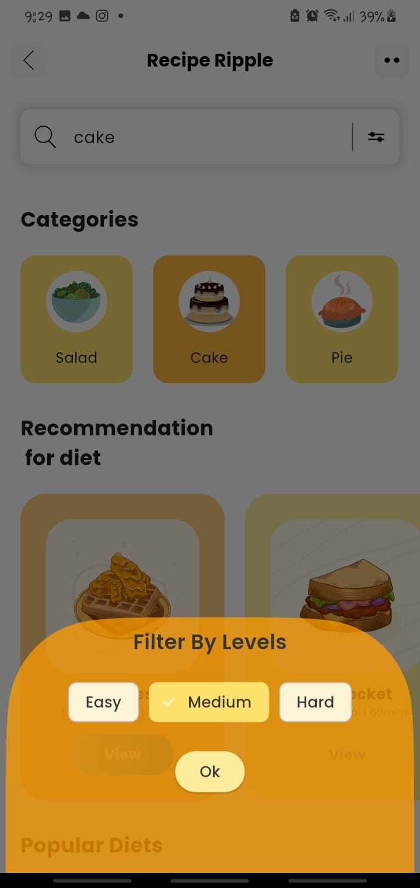
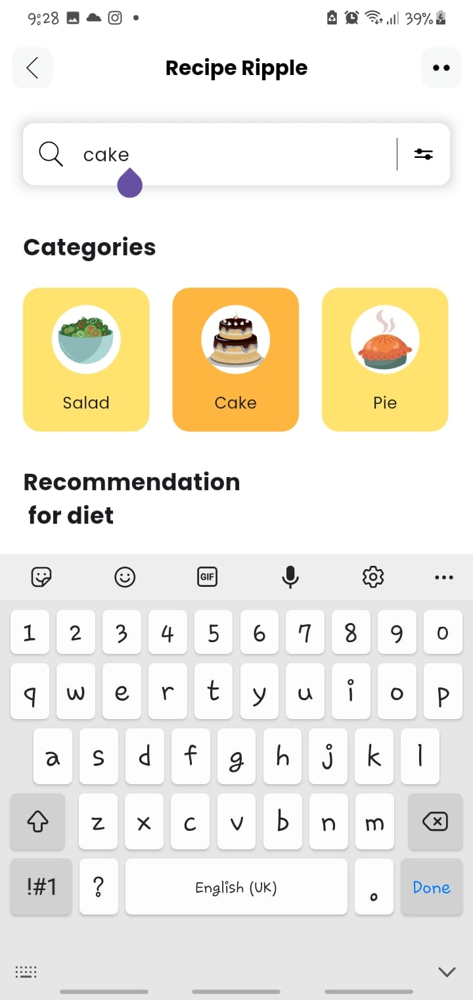

# 🥗 Recipe Ripple

A simple Flutter mobile app to browse recipes. This was my first Flutter project, built to learn UI layouts, search functionality, and filtering in Flutter.


## 🍳 About

Recipe Ripple displays a collection of hardcoded recipes for various dishes. Users can search recipes by name and filter them by difficulty level - Easy, Medium, or Hard.

## ⚡ What I Learned

- Building UI layouts with Flutter widgets
- Implementing search functionality to find recipes by name
- Adding filter options based on difficulty levels
- Managing state for interactive features

## ✨ Features

- 🔍 **Smart Search** : Search recipes by name, ingredient, or keyword 
- 🥗 **Diet Filtering** : Filter recipes by difficulty: Easy, Medium, or Hard 
- 📂 **Category Browsing** : Explore recipes organized by meal type and cuisine 
- 📄 **View recipe details** : See full recipe information including ingredients and steps
- 🔄 **setState** | Manage UI updates when searching or filtering recipes
- 🧭 **Flutter Navigator** | Navigate between screens using push and pop

## 🛠 Tech Stack

| Layer | Technology |
|-------|------------|
| **Framework** | [Flutter](https://flutter.dev) |
| **Language** | [Dart](https://dart.dev) |
| **State Management** | `setState` / Provider (update as per your implementation) |
| **Navigation** | Flutter Navigator |
| **UI Design** | Material Design 3 |

## 🚀 Getting Started

### Prerequisites

- [Flutter SDK](https://docs.flutter.dev/get-started/install) (&gt;= 3.0.0)
- [Dart SDK](https://dart.dev/get-dart)
- Android Studio / Xcode (for emulators)
- A physical device or emulator

### Installation

```bash
# Clone the repository
git clone https://github.com/yourusername/recipe-ripple.git

# Navigate to the project
cd recipe-ripple

# Install dependencies
flutter pub get

# Run the app
flutter run
```

## Screenshots

<p align="center">
  
  
  
  
</p>

---

## 🛠 Tech Stack

| Layer | Technology |
|-------|------------|
| **Framework** | [Flutter](https://flutter.dev) |
| **Language** | [Dart](https://dart.dev) |
| **State Management** | `setState` |
| **Navigation** | Flutter Navigator |
| **UI Design** | Material Design 3 |


